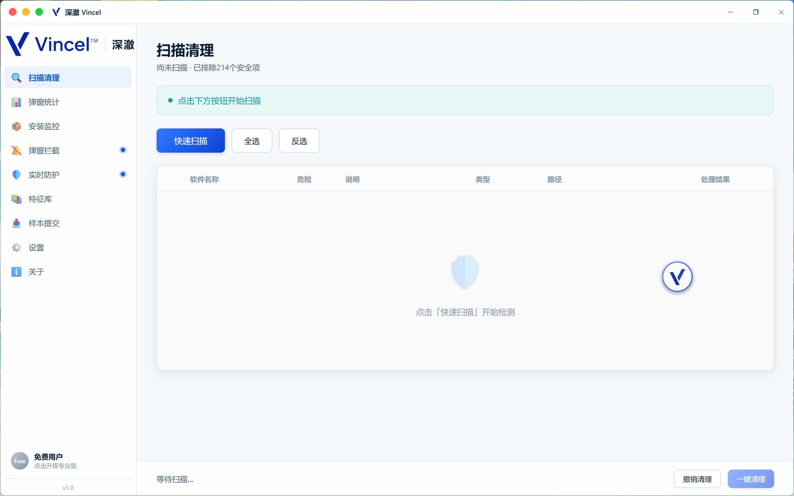

# 深澈 Vincel

**专注于“驻留项类”组件的 Windows 清理工具：启动项、系统服务、计划任务、浏览器劫持、右键菜单残留，以及卸载不完全留下的残留。**

[English](README.md) · 官网：https://vincel.netlify.app/ · [下载](https://github.com/metacoves/vincel/releases)

## 下载

- **GitHub Releases**（安装包 + 绿色版）：https://github.com/metacoves/vincel/releases
- 官网：https://vincel.netlify.app/ （安装版 / 绿色版，内嵌 WebView2 引导安装包）

## 为什么做深澈

通用卸载器（Geek Uninstaller、Bulk Crap Uninstaller、Revo 等）围绕注册表的"已安装程序列表"工作：卸软件很强，但**系统性覆盖不了"驻留项"**：

- 启动项、系统服务、计划任务
- 浏览器劫持（主页/搜索引擎）与快捷方式劫持
- 右键菜单残留
- 卸载不完全留下的目录/注册表残留

在国内 Windows 生态里，相当一部分不需要的软件是以"捆绑安装/预装"形式进来的，并通过启动项和服务长期驻留；而通用卸载器及其特征库并不针对这个生态。

深澈瞄准的就是这个缺口，并针对国内 Windows 生态专门优化：扫描驻留项与已知的捆绑/预装软件家族，以管理员权限清理，并且**清理前自动备份（备份范围内）的操作，多数改动可以还原**。

## 界面

## 当前能力（v1.0）

**扫描**

- 已安装程序（注册表 `Uninstall` 条目），与内置特征库匹配（231 条）
- 启动项：`HKCU/HKLM Run`、`RunOnce` + 启动文件夹
- 系统服务、计划任务
- 浏览器劫持点（IE / Chromium 主页与搜索引擎设置）
- 浏览器快捷方式劫持
- 右键菜单残留
- AppData 目录残留

**清理**

- 以管理员权限清理上述项目（删除失败时提供强制删除兜底）
- 对**有驱动自我保护的软件家族**（国内安全类软件常见），不直接删文件，而是**调用厂商自带卸载程序**，等待用户完成卸载向导后自动重扫并清理残留
- **清理前自动备份**：文件、目录、注册表值/键、计划任务；支持一键还原上次清理。单文件超过 100MB、单次备份总量超过 2GB 的内容会跳过，以控制磁盘占用

**监控（仅提醒，不拦截）**

- 安装监控：检测到安装程序启动（Windows 进程启动事件）时通知用户。只观察，不阻止。

## 不做什么

- **不是杀毒软件**，不提供实时防护
- 安装监控**只提醒不拦截**，不会阻止安装
- 付费功能（专业版：安装拦截、弹窗拦截、主页防护、云特征库更新）**尚在规划中、未实现**。GPLv3 核心功能免费且完全开源

## 技术架构

| 层 | 实现 |
|---|---|
| 界面 | `wwwroot/index.html`（WebView2 渲染，纯 HTML/JS） |
| 外壳 | C# WinForms，.NET Framework 4.7.2，AnyCPU |
| 前后端通信 | 通过 `AddHostObjectToScript` 向 WebView2 暴露 `JsBridge.cs`；`LocalWebServer.cs` 提供本地界面资源 |
| 扫描/清理 | `Scanner.cs`、`Cleaner.cs`、`Signatures.cs`、`BackupManager.cs` |
| 监控 | `InstallWatcher.cs`、`PopupCounter.cs`、`FloatingBall.cs`、`AutoStartHelper.cs` |
| 遥测/样本上传 | 腾讯云 CloudBase（云函数 + 文档数据库），设备 ID 本地存储 |
| 更新 | `UpdateService.cs`——检查 `update.json`、SHA-256 校验、Inno Setup 静默安装 |

## 构建

**要求**：Visual Studio 2022 **17.10+**（解决方案为 `.slnx` 格式）、.NET Framework 4.7.2 目标包。

1. 克隆仓库
2. 打开 `vincel.slnx`
3. 还原 NuGet 包
4. 生成（F5）

**发布构建**：`build-release.ps1` / `发版.bat`，生成 Inno Setup 安装包与绿色版 zip。

前置条件：
1. 安装 **Inno Setup 6**（https://jrsoftware.org/isdl.php）
2. 从微软官方下载 **WebView2 Evergreen 引导安装包**，命名为 `MicrosoftEdgeWebview2Setup.exe`，放入 `WebView2Runtime\` 目录（不随仓库分发，已被 `.gitignore` 忽略）

## 系统要求

- **Windows 10 / 11**（推荐）
- .NET Framework 4.7.2
- **WebView2 运行时**（Windows 11 自带；缺失时安装器会自动安装）
- 说明：微软已停止对 Windows 7 / 8.1 的 WebView2 运行时支持。程序在这些系统上可能仍能运行，但不受官方支持。

## 隐私

- 匿名遥测字段：随机生成的设备 ID、应用版本、系统版本、功能使用事件；**可在设置中关闭**；不采集文件内容、文件路径或个人信息
- 设备 ID 本地存储：`%LOCALAPPDATA%\RogueCleaner\device_id.txt`
- 用户主动提交的样本（可选）：用户填写的软件名称、问题描述、路径，与匿名设备 ID 关联
- 诊断日志**仅本地**（`%LOCALAPPDATA%\RogueCleaner\clean.log`），从不上传
- 隐私声明：https://vincel.netlify.app/privacy.html

## 许可证

GPLv3——见 [LICENSE](LICENSE)。

计划中的闭源"专业版"插件的授权方案仍在评估中，尚未最终确定。
